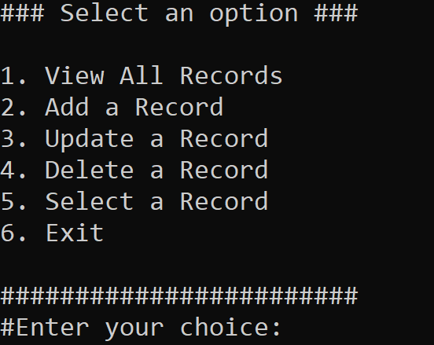

  

  <h3 align="center">C# & Data manipulation ( Json )</h3>

  

    The open-source Data Manipulation With C#
     
    <a href="https://t.me/Fareszz">Telegram</a>
    ·
    <a href="https://github.com/Fareszz1/C-Sharp.Data.Manipulation-Json/issues">Issues</a>
    ·
    <a href="https://visualstudio.microsoft.com/downloads/">Visual Studio</a>
  

## About the Project

"In this C# code, you'll delve into the realm of JSON data manipulation. You'll learn how to store, retrieve, update, and delete data from a JSON file using C#. Through a simple console interface, you'll grasp fundamental concepts like serialization and deserialization, ensuring your ability to interact with data seamlessly. Whether you're a beginner or an experienced coder, this code offers a practical journey into the world of managing JSON data using C#."

# More Than a Data manipulation program

- 📁 Database Persistence: Stores records in a JSON file for long-term data storage.
- 🔄 Dynamic Refresh: Reloads database from file on every user interaction to reflect latest changes.
- 📋 CRUD Operations: Enables Create, Read, Update, and Delete actions for database records.
- 📝 Input Validation: Validates user inputs to ensure data integrity and prevent errors.
- 🔄 Continuous Loop: Maintains an infinite loop for seamless user interaction until program exit.
- 🖥️ Clear Console: Clears console screen before displaying menu options for improved readability.
- 📊 Record Viewing: Allows users to view all records stored in the database.
- ➕ Record Addition: Facilitates adding new records to the database with unique identifiers.
- ✏️ Record Updating: Supports updating existing records and modifying records .
- ❌ Record Deletion: Enables deletion of records from the database based on their IDs.

### Built With

- [C#](https://dotnet.microsoft.com/en-us/languages/csharp)
- [Newtonsoft.Json](https://www.newtonsoft.com/json)

## Getting Started

1. **Download the Visual Studio**: First, download the Visual Studio. You can copy the code from the source and paste it into a new file in Visual Studio.
2. **Open Visual Studio**: Launch Visual Studio on your computer.
3. **Create a New Project**: Click on "Create a new project" or go to "File" > "New" > "Project..." to create a new project in Visual Studio.
4. **Select Console App Template**: Choose the "Console App (.NET Core)" or "Console App (.NET Framework)" template depending on your Visual Studio version. Give your project a name and specify the location where you want to save it.
5. **Paste the Code**: Once the project is created, open the file containing the default code (Program.cs). Replace the default code with the code you downloaded earlier.
6. **Install Newtonsoft.Json Package (if needed)**: If you haven't installed the Newtonsoft.Json package in your project yet, you'll need to do so. Right-click on your project in the Solution Explorer, select "Manage NuGet Packages...", search for "Newtonsoft.Json", and install it.
7. **Build the Solution**: Press Ctrl + Shift + B or go to "Build" > "Build Solution" to build your project. This step will compile your code and check for any errors.
8. **Run the Application**: Press F5 or go to "Debug" > "Start Debugging" to run your application. Alternatively, you can press Ctrl + F5 or go to "Debug" > "Start Without Debugging" to run it without debugging.
9. **Interact with the Console Interface**: Once the application is running, you'll see a console window with menu options. Follow the prompts to interact with the database: view records, add, update, delete, or select a record.
10. **Exit the Application**: To exit the application, select option 6 from the menu. This will save any changes made to the database and close the program.

( By following these steps, you'll be able to download, run, and interact with the JSON data manipulation code in Visual Studio effectively. )
* And try to read the code and understand it

## Fareszz
